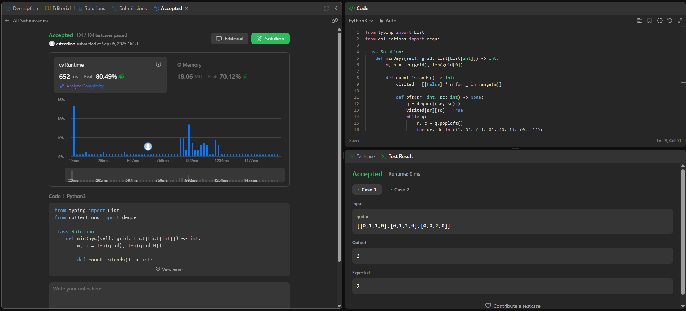
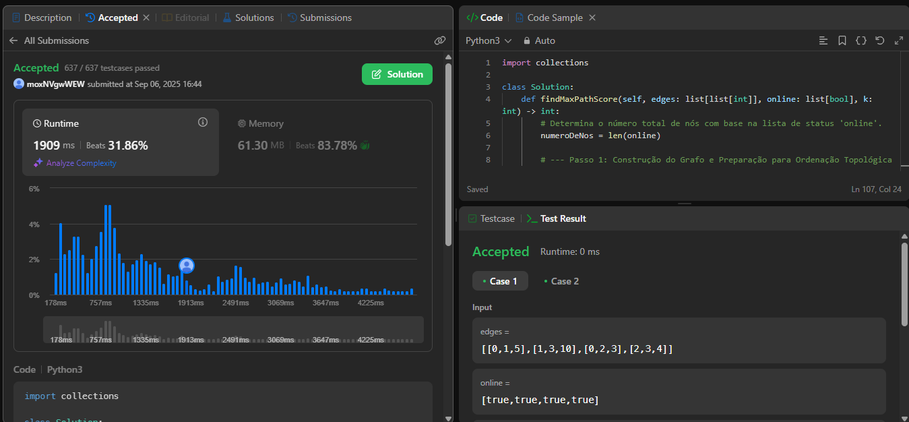
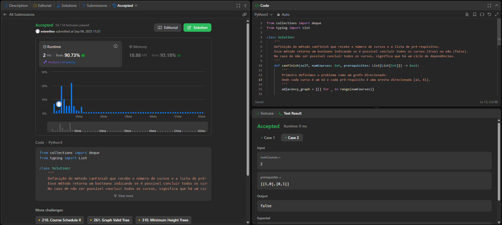
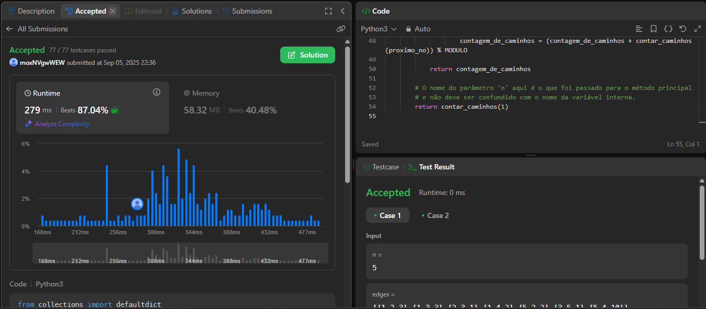

# Trabalho 1 - Grafos 1

**Número do trabalho:** 1  
**Conteúdo da Dsiciplina: Grafos**

## Alunos

| Matrícula |        Nome Completo       |
|:---------:|:-------------:|
| 20/2063201 | Ester Flores Lino da Silva |
| 20/2042927 | Eduardo Schuindt Santos    |

## Definição do Trabalho

Para o Trabalho 1 a dupla optou por solucionar questões da plataforma **[LeetCode](https://leetcode.com/)**. Seguindo as orientações do professor Maurício Serrano, resolvemos 4 desafios. Dois do nível difícil e dois do nível médio. Dessa maneira, a dupla busca demonstrar o conhecimento adquirido durante as aulas e estudos sobre o tema Grafos 1.

Sobre a realização do trabalho, cada exercício contém seu código resposta, screenshots da tela de submissão do **[LeetCode](https://leetcode.com/)** e vídeo de até 5 minutos explicando objetivamente as resoluções propostas.

## Linguagem utilizada

A linguagem de programação utilizada para resolver cada exercício foi o Python.

## Screenshots

### Exercício 01 - Difícil - 1568. Minimum Number of Days to Disconnect Island

### Exercício 02 - Difícil - 3620. Network Recovery Pathways

### Exercício 03 - Médio - 207. Course Schedule

### Exercício 04 - Médio - 1786. Number of Restricted Paths From First to Last Node

## Vídeo de apresentação do Trabalho 1

## Verificação

Para verificar se as resoluções aqui propostas estão corretas e foram aceitas, submeter os códigos no **[LeetCode](https://leetcode.com/)** e conferir se foi aceito ou não. Todo exercício contém o link para descrição do problema no seu próprio código de resolução.
